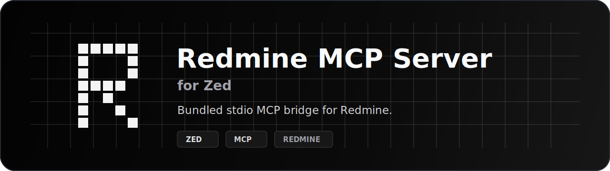

<p align="center">
  
</p>

<p align="center">
  <a href="README.md">English</a>
  ·
  <a href="docs/client-configuration.zh-CN.md">客户端配置</a>
  ·
  <a href="docs/api-coverage.md">API 覆盖</a>
  ·
  <a href="SECURITY.md">安全</a>
</p>

# Redmine MCP Server for Zed

用于 Zed 的 Redmine MCP 扩展。它注册 `redmine` MCP context server，并通过
Zed 内置 Node.js 运行时启动随附的 Redmine stdio MCP server。

独立 server 作为 `redmine-mcp-server` 单独分发。本仓库只维护 Zed 扩展。

<p>
  
  
  
  
</p>

## 运行要求

- 支持 MCP 扩展的 Zed
- Redmine 已开启 REST API
- Redmine API key 具备目标项目所需权限
- 仅在使用检查清单工具时需要 Redmine Checklists 插件

## 安装

发布后可通过 Zed 扩展市场安装。

本地开发时，clone 本仓库并通过 Zed 开发扩展流程加载。扩展默认使用随附的
`server/index.js`，无需单独安装 server。

## 配置

在 Zed settings 中配置 `redmine` context server：

```json
{
  "context_servers": {
    "redmine": {
      "settings": {
        "REDMINE_BASE_URL": "https://redmine.example.com",
        "REDMINE_API_KEY": "your-api-key",
        "REDMINE_MCP_READ_ONLY": false
      }
    }
  }
}
```

常用配置：

| 变量 | 必填 | 默认值 | 说明 |
| --- | --- | --- | --- |
| `REDMINE_BASE_URL` | 是 | 无 | Redmine 实例地址。 |
| `REDMINE_API_KEY` | 是 | 无 | Redmine REST API key。 |
| `REDMINE_MCP_READ_ONLY` | 否 | `false` | 隐藏并拒绝写工具。 |
| `REDMINE_MCP_ENABLE_DELETES` | 否 | `false` | 暴露破坏性删除/移除工具。 |
| `REDMINE_TIMEOUT_MS` | 否 | `30000` | HTTP 请求超时时间，单位毫秒。 |

更多功能开关和外部客户端示例见
[docs/client-configuration.zh-CN.md](docs/client-configuration.zh-CN.md)。

## 工具

扩展提供 Redmine 问题、项目、元数据、附件、Wiki、问题关联、检查清单、工时、
版本和关注者工具。

支持的 API 范围见 [docs/api-coverage.md](docs/api-coverage.md)。

## 开发

```sh
scripts/check.sh
```

检查脚本会执行 JavaScript 校验、Node.js 测试、Rust 格式检查、Clippy 和 Zed
WASI target 检查。

## 发布

本仓库不发布插件 tarball。Zed 扩展发布通过 Zed 扩展市场完成。

## 安全

实际权限由配置的 Redmine API key 决定。建议为目标项目使用最小必要权限；不需要
写操作时，启用 `REDMINE_MCP_READ_ONLY=true`。

漏洞报告请参考 [SECURITY.md](SECURITY.md)。
